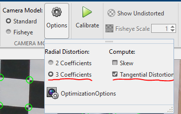

# CalibrationParameters-Matlab2NumPy

This repo is for the conversion of a MATLAB style `.mat` calibration parameter to a OpenCV style numpy `.npz` file.

Note: OpenCV, by default, uses 3 parameters for radial disotrtion and 2 parameters for tangencial distortion. Make sure that during the MATLAB calibration, 3 coefficients setting for Radial Distortion is chosen and also compute tangential distortion is chosen. 



## How to convert `.mat` to `.npz`?
1. Calibrate the camera as usual using MATLAB and save the parameters. Here teh saved file will be referred as `camera_parameters`.
   
2. Save as the `camera_parameters` as a struct : 
    ```matlab
    camera_parameters_struct = struct(camera_parameters)
    ```
3. Clone this repository to the folder where the `.mat` file is saved to
    ```
    git clone https://github.com/yusufguleray/CalibrationParameters-Matlab2NumPy.git
    ```
4. Run the script with first argument as the name of the name of the `.mat` file, second argument for the name of the numpy file to be created.
    ```
    python .\CalibrationParameters-Matlab2NumPy\mat2np.py <camera_parameters_struct.mat> <name_of_output.npz>
    ```
## How to use the calibration data from `.npz` file?
```python
import utils

calib_file_name = "output.npz"
calib_mtx, dist_coef = utils.getCalibData(calib_file_name)
```